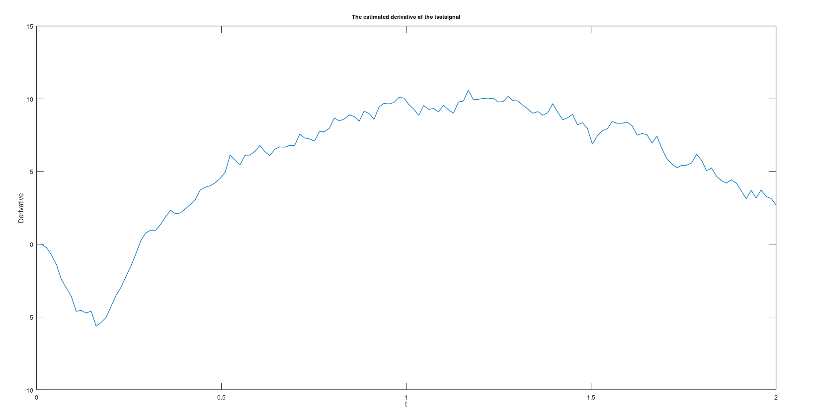

# KalmanFilterExample
## Project
This is an example on how to use a Kalman Filter to estimate missing sensor axis. It shows the basic design and usage of a Kalman Filter. On the IMU the measurement unit to measure angular speed around the y-axis is broken, it was replaced by an estimate generated from the data of a magnetometer.
## Hardware
An Arduino nano V3.3 is used for processing. The magnetometer is a QMC5883L and as IMU, the MPU6050 is used.
## Software
For simulation, Octave is used since it is an open source alternative to MatLab.
For programming the Arduino, the Arduino IDE is used. If wished, I could do a C++ only with i.e. Makefile. Also other microcontrollers can be targeted if wished. If you're interested, please open an issue and let me know.
## Simulation Results
The Kalman Filter was designed with the help of the datasheets of the sensors. To test and verify it, a test signal is used.

As can be seen, the filter seems to work properly. The noise is reduced successfully. In the beginning, a transient can be seen, because the chosen starting vector for angle and angular speed (the signal and it's derivative respectively) didn't match the initial value of the testsignal. Otherwise the signal is filtered nicely. When it comes to the change in Kalman Gain, the difference between the previous and the current gain is used as a metric. As can be seen, it converges to zero as expected.

This means, the process of recalculating the Kalman Gain in every iteration of the microcontroller can be neglected and the final Kalman Gain can be used directly. Lastly, the angular velocity (derivative of the signal) needs to be invesitgated:

Also the initial transient can be observed. What is also worth noting is the last value. Since the test signal is cosine shaped, the last value is expected to be zero. The reason for this to be incorrect is the filter delay. The filter needs some time to calculate the estimated value and is therefore delayed by some samples. Because of that the derivative didn't reach zero by the end of the test signal.
## Implementation
In the implementation part there are a view things to take care of. First of all, the sensors need to be calibrated first. If this is not the case, no reliable data can be retrieved. When calibrating the magnetometer, beware of artificial magnetic fields in the area of the sensor. In this example an ISR was used to determine, when to read the sensor data. The interrupt is generated by the MPU6050 and is triggered at around 77Hz. Reading the data and performing the calulations were then done in the main loop. Reason being the data reading time being to high. The result seems correct.

Here ``vangle`` is the angular velocity and ``vest`` is the estimated angulaer velocity. Again the filter delay can be observed. Aside from that, the data is also smoothed, which in this case is an advantage. The overall execution time of the filter was around 3ms. This is quite slow. The reason for that is the Arduino (processor: atmega328p) itself. It has no FPU (floating point unit) and a clock speed of 16Mhz. Functions like ``atan2()`` are very expensive when it comes to computing power. To speed up the calulations, another processor might be better. I.e. an ARM Cortex M4 device with FPU would be an option. If considered an STM32 device i.e., the clock speed is 5-10 times faster than the Arduino's and because of the FPU multiplications are atleast 5 times faster. This results in an estimated performance gain of factor 5. This would approximate to 0.6ms for execution time for this filter.